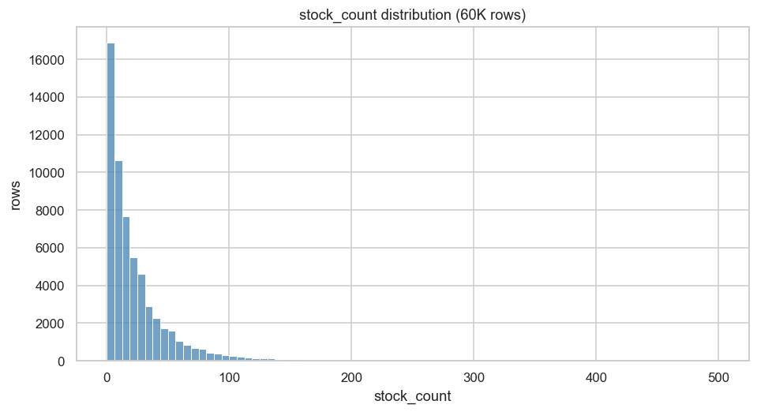
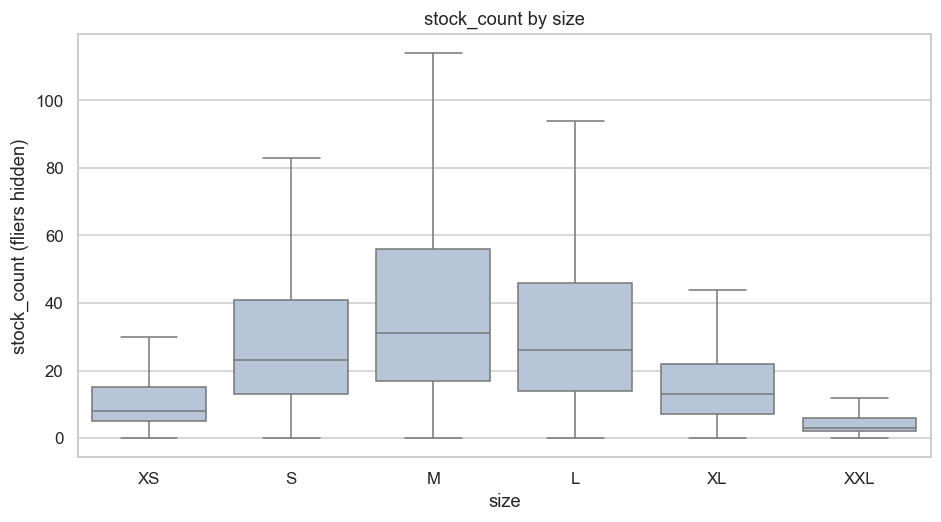
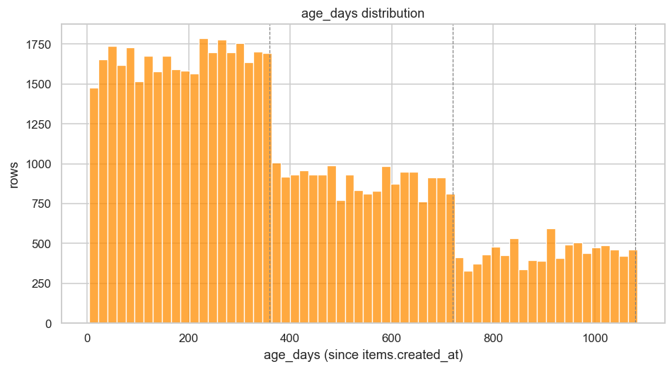
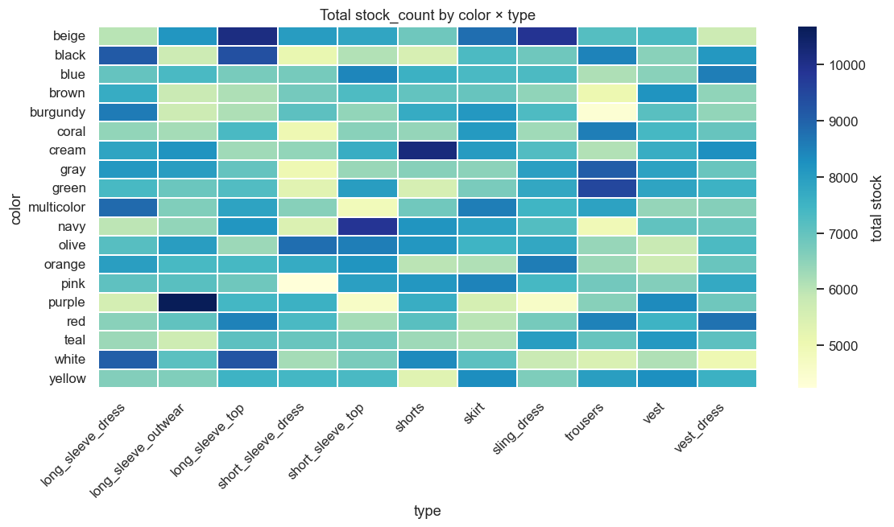
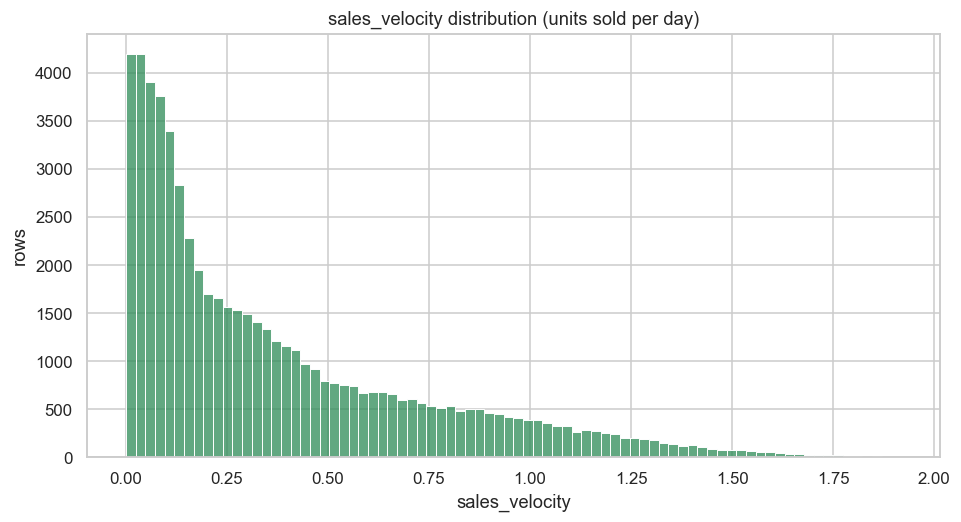
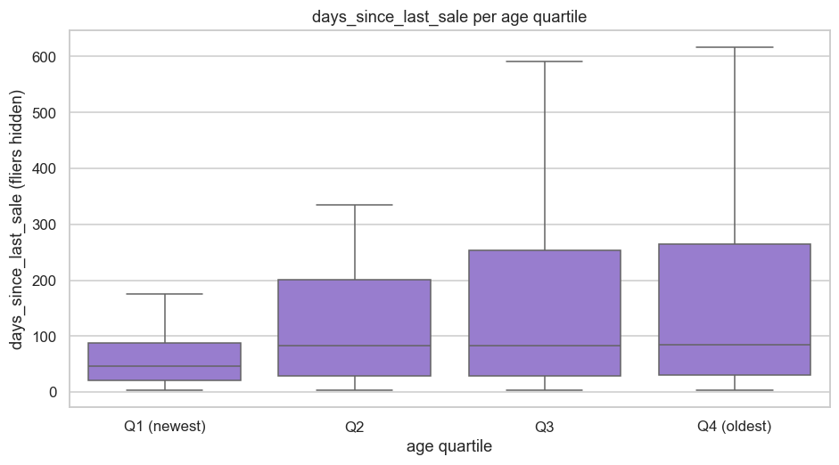
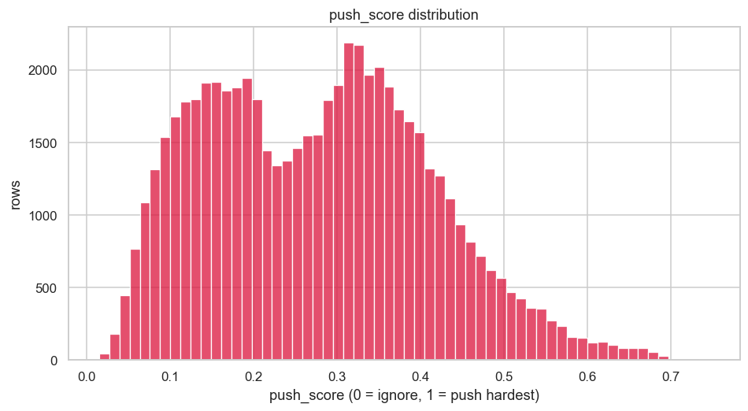
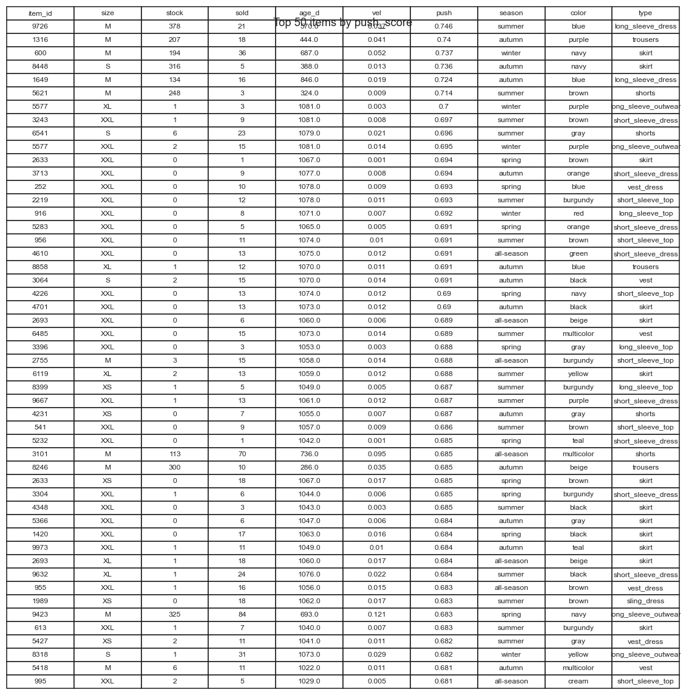
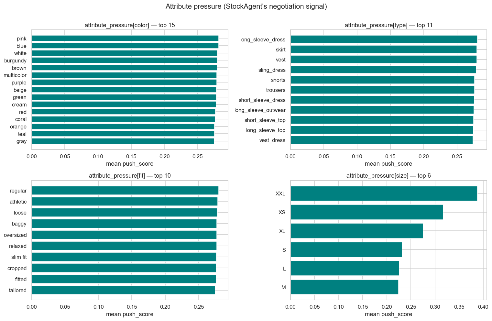
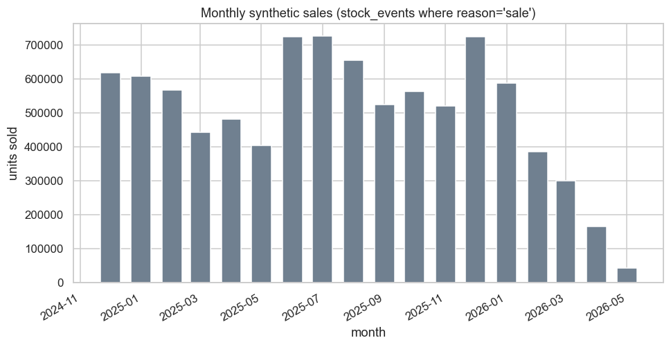

# StockAgent — Sanity Plots

Auto-generated by `stock_agent/sanity_plots.py`. Read-only on the DB.

Each section embeds one figure + the numbers behind it. Re-run the script after `seed_stock.py --force` or any change you want to visually verify.

---

## 1. Stock distribution (overall)

Right-skewed as expected. Median=14, p95=82, max=500. The fat tail past p95 is the planted 8% overstock outliers from the seeder.

---

## 2. Stock per size

Per-size box. Mean stock by size: XS=11.9, S=33.0, M=44.7, L=37.4, XL=17.9, XXL=4.5. M heaviest, XXL lightest — matches the seeder size_mult.

---

## 3. Age histogram

Three year-buckets: <360d=32784 (55%), 360–720d=18132 (30%), ≥720d=9084 (15%). Seeder target 55/30/15.

---

## 4. Color × Type heatmap

Coverage check: 0/209 cells are zero (genuine gaps where a color/type pair has no items in the catalogue). No systematic collapse — every color has stock in multiple types.

---

## 5. Sales velocity distribution

Median velocity=0.242/day. 14.6% of rows have velocity < 0.05/day — the planted underperformer tail (~15% target). High-velocity tail = fast movers the agent will rank LOW (push_score's perf_score inverts velocity).

---

## 6. Gap per age quartile

Means: Q1 (newest)=59.0d, Q2=117.0d, Q3=156.4d, Q4 (oldest)=201.0d. Strictly increasing → older items haven't sold recently, as expected.

---

## 7. Push score distribution

In [0, 1.0] by construction (active=0 rows clamped to 0). Median=0.278, p95=0.505, max=0.746. The right tail is what StockAgent will argue to push.

---

## 8. Top 50 push items

Top-50: 86% are ≥720d old, 100% have sales_velocity<0.5/d. Cross-checks the seeder's smoke assertion #4.

---

## 9. Attribute pressure

Per-attribute mean push_score, sorted desc. Highest-pressure value per axis: color=pink (0.282), type=long_sleeve_dress (0.281), fit=regular (0.280), size=XXL (0.388). These are the values StockAgent will argue most strongly for in Phase 2.

---

## 10. Monthly sales (event log replay)

9,035,596 sale units across 18 months. Older months show higher cumulative sales because items had more days to accumulate them in the seeder model.

---
